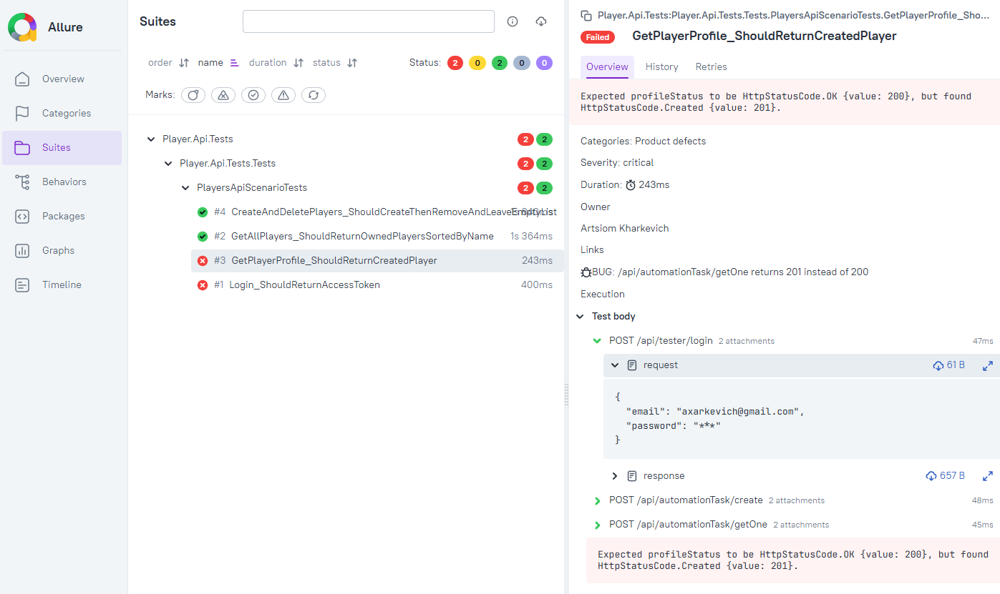

# GamePlatform.Tests

C# API tests (xUnit + HttpClient + Allure)

## !!! BUGS !!!

- **login** - OpenAPI expected `access_token` / oauth-style fields; real response is `accessToken` + a `user` object. Also returns **201** instead of **200**
- **create** - OpenAPI expected `id: int`; real response has string `_id` (and also passwords / `__v`)
- **create** - returns `_id`, getOne/getAll return `id`
- **getOne** - OpenAPI expected 201 + int id; actual is **200** + string `id`
- **getAll** - OpenAPI shows a single object; actual is an array, with string `id` (not `_id`)
- **delete** - path `id` is documented as int, but you need a string ObjectId

I don't use generated NSwag client because the OpenAPI specification mismatches the real contract. So I decided to write tests with HttpClient. On a real project, I'd insta raise bugs for this stuff

## How to run

```bash
dotnet test Player.Api.Tests/Player.Api.Tests.csproj
```

Allure:

```bash
dotnet test Player.Api.Tests/Player.Api.Tests.csproj -s Player.Api.Tests/allure.runsettings
```

Results check in `./allure-results`

View the report:

```bash
# if you have Allure CLI
allure serve allure-results

# or docker put your absolute path to allure-results
docker run -it --rm -p 5050:5050 \
  -v "/absolute/path/to/GamePlatform.Tests/allure-results:/app/allure-results" \
  frankescobar/allure-docker-service
```

Open http://localhost:5050

Report example:



## Tester credentials

Locally use user secrets, in CI use env vars

Load order: `appsettings.{env}.json` -> user secrets -> environment variables

Env is selected via `TEST_ENVIRONMENT` (default is `dev`)

```bash
dotnet user-secrets init --project Player.Api.Tests --id gameplatform-tests-player-api
dotnet user-secrets set "TestSettings:Tester:Email" "YOUR_EMAIL" --project Player.Api.Tests
dotnet user-secrets set "TestSettings:Tester:Password" "YOUR_PASSWORD" --project Player.Api.Tests
```

```powershell
$env:TestSettings__Tester__Email = "YOUR_EMAIL"
$env:TestSettings__Tester__Password = "YOUR_PASSWORD"
```

```bash
export TestSettings__Tester__Email="YOUR_EMAIL"
export TestSettings__Tester__Password="YOUR_PASSWORD"
```

## Regenerating the OpenAPI client

From the repo root, if you need to regenerate the NSwag client:

```bash
nswag openapi2csclient /input:GamePlatform.Tests.Infrastructure/OpenApi/PlayerApi.json /classname:PlayerApiClient /namespace:GamePlatform.Tests.Infrastructure.Clients /output:GamePlatform.Tests.Infrastructure/Clients/PlayerApiClient.cs /GenerateClientInterfaces:true /UseBaseUrl:false /InjectHttpClient:true /DisposeHttpClient:false /GenerateExceptionClasses:true /ExceptionClass:PlayerApiException /JsonLibrary:SystemTextJson /GenerateOptionalParameters:true /OperationGenerationMode:SingleClientFromOperationId
```
